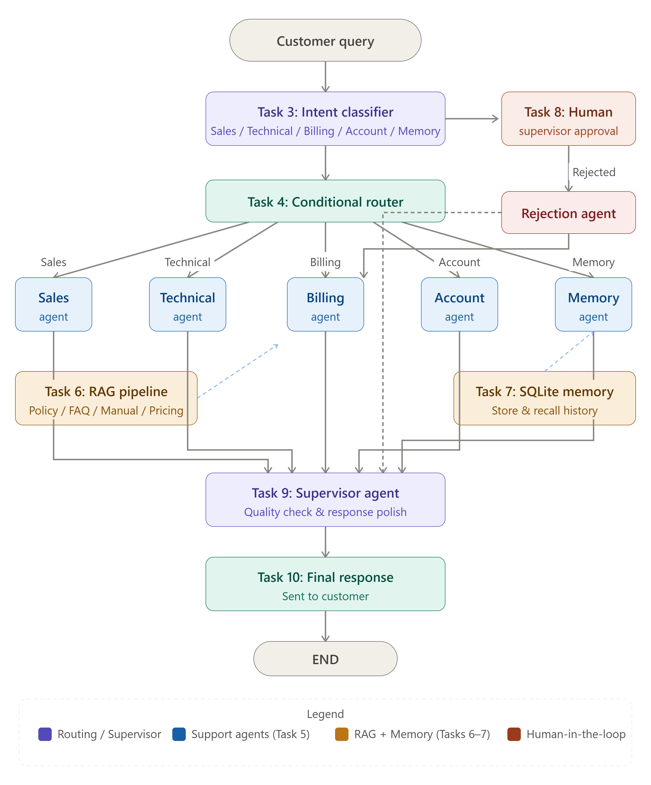

# AI-Powered-Customer-Support-Automation-System
AI-Powered Customer Support Automation System using LangGraph, Ollama (qwen2.5:3b model), SQLite 

## Overview

An AI-powered Customer Support Automation System built using **LangGraph + Ollama (qwen2.5:3b) + SQLite**.

The system classifies customer queries, routes them to specialized support agents, retrieves relevant knowledge using RAG, and includes Human-in-the-Loop approval for high-risk requests — all with persistent memory using SQLite.

---

## Tech Stack

| Tool | Purpose |
|---|---|
| LangGraph | Workflow graph & state management |
| Ollama (qwen2.5:3b) | Local LLM for classification & responses |
| SQLite (SqliteSaver) | Persistent conversation memory |
| LangChain Core | Message handling |
| Rich | Beautiful terminal output |

---

## File Structure

```
project/
├── customersupport.py        ← Main code (all 10 tasks)
├── Company_policy.txt        ← Refund, cancellation & escalation policies
├── Pricing_guide.txt         ← Subscription plans & pricing info
├── Technical_manual.txt      ← Error codes, file formats, browser support
├── FAQ_document.txt          ← 30 frequently asked questions
├── memory.db                 ← Auto-generated SQLite memory database
├── langgraph_workflow_diagram.png  ← Workflow diagram
└── Output Screenshots.pdf    ← Demo run output screenshots
```

---

## Setup Guide

### 1. Create Virtual Environment
```bash
py -3.12 -m venv venv
```

### 2. Activate Environment
```bash
.\venv\Scripts\Activate.ps1
```

### 3. Pull Ollama Model
```bash
ollama pull qwen2.5:3b
```

### 4. Install Dependencies
```bash
pip install langgraph langchain-ollama langchain-core rich
```

### 5. Open in VS Code
```bash
code .
```

### 6. Run the Program
```bash
python customersupport.py
```

---

## Task Summary

| Task | Description | Function |
|---|---|---|
| Task 1 | LangGraph workflow design | `build_graph()` |
| Task 2 | State structure | `SupportState` TypedDict |
| Task 3 | Intent classification node | `classify_node()` |
| Task 4 | Conditional routing | `route_query()` |
| Task 5 | Specialized support agents | `sales_agent()`, `technical_agent()`, `billing_agent()`, `account_agent()` |
| Task 6 | RAG pipeline | `rag_retrieve()`, `_rag_agent()` |
| Task 7 | SQLite memory | `memory_agent()`, `SqliteSaver` |
| Task 8 | Human-in-the-loop | `human_approval_node()`, `route_after_approval()` |
| Task 9 | Supervisor agent | `supervisor_agent()` |
| Task 10 | Demo with 5 queries | `run_demo()` |

---

## LangGraph Workflow Diagram



---

## Demo Queries & Expected Routing

| # | Query | Routed To |
|---|---|---|
| 1 | What are the pricing plans? | Sales Agent |
| 2 | I forgot my account password | Account Agent |
| 3 | My app crashes when uploading a file | Technical Agent |
| 4 | I need a refund for my annual subscription | Human Approval → Billing Agent |
| 5 | What was my previous support issue? | Memory Agent |

---

## Human-in-the-Loop (Task 8)

For the following high-risk queries, the system **pauses and asks the supervisor**:

- Refund requests
- Cancel subscription
- Close account
- Compensation requests
- Escalation requests

```
Approve this request? [approve/reject]
```

- `approve` → Routes to the billing/account agent to generate a response
- `reject` → Generates a polite rejection message

---

## RAG Pipeline (Task 6)

- Loads 4 knowledge base `.txt` files at startup
- Splits documents into overlapping word-level chunks
- Scores chunks by keyword match with the customer query
- Returns the top 3 most relevant chunks to the LLM
- All agents use RAG context to generate accurate responses

---

## SQLite Memory (Task 7)

- All interactions are saved automatically to `memory.db`
- Query 5 ("What was my previous issue?") reads from this database
- In interactive mode, conversation history is preserved across sessions per `thread_id`

---

## Output Screenshots

Screenshots of all 5 demo queries are available in **Output Screenshots.pdf**

---

## How to Run — Two Modes

When you run `python customersupport.py`, choose:

```
1 — Demo mode   (5 sample queries, Task 10)
2 — Interactive mode (type your own queries)
```
